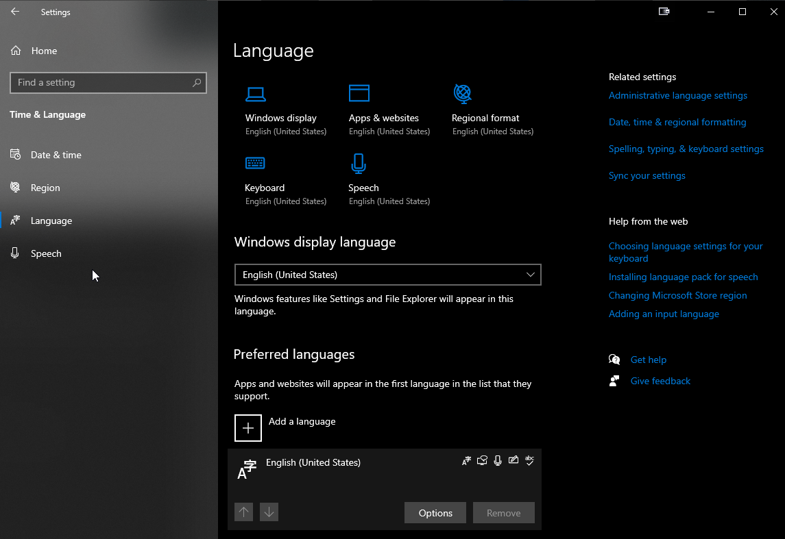
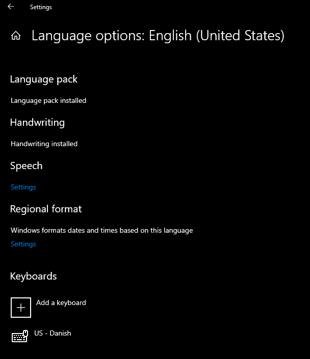

# us-da-keyboard-layout
This is a US keyboard layout for Window with support for the Danish characters æ, ø, å, Æ, Ø, and Å.

## How to Install
1. Open us-da folder and run setup.exe.
2. Restart your computer
3. Go into Settings > Time & Language > Language
4. Click Options on they language which you want to add the new keyboard layout.
5. Click Add a keyboard
6. Find and click on US - Danish from the list
7. Optionally you can remove your previous keyboard by clicking on it and then click Remove.

  
Images of Language Setting

## How to Use (Key Mapping)

If your keyboard does not have an AltGr key then you can use right alt instead.

| Character | Key Mapping  |
|-----------|--------------|
| å         | AltGr+a a    |
| Å         | AltGr+a A    | 
|           | AltGr+A a    |
|           | AltGr+A A    |   
| æ         | AltGr+a a    | 
| Æ         | AltGr+a E    | 
|           | AltGr+A e    |
|           | AltGr+A E    |  
| ø         | AltGr+o o    |
|           | AltGr+o e    | 
| Ø         | AltGr+o O    |  
|           | AltGr+O o    |  
|           | AltGr+O O    |
|           | AltGr+o E    |
|           | AltGr+O e    |
|           | AltGr+O E    |  

## How to Use (Elaborated)

  
Åå

You can write 'å' by holding right alt down and press 'a', release alt again, and press 'a' a second time.

You can write a capital 'Å' by holding right alt down and (left or right) shift, and press 'a', release alt and shift again, and press 'a' a second time.

Another option is to write a capital 'Å' is by holding right alt down and press 'a', release alt, and hold (left or right) shift again, press 'a' second time, and release shift.

  
Ææ

You can write 'æ' by holding right alt down and press 'a', release alt again, and press 'e'.

You can write a capital 'Æ' by holding right alt down and (left or right) shift, and press 'a', release alt and shift again, and press 'e'.

Another option is to write a capital 'Æ' is by holding right alt down and press 'a', release alt, and hold (left or right) shift again, press 'e', and release shift.

  
Øø

You can write 'ø' by holding right alt down and press 'o', release alt again, and press 'o' a second time.

You can write a capital 'Ø' by holding right alt down and (left or right) shift, and press 'o', release alt and shift again, and press 'o' a second time.

Another option is to write a capital 'Ø' is by holding right alt down and press 'o', release alt, and hold (left or right) shift again, press 'o' second time, and release shift.

## Limitations
Some applications might override the key mapping of æ ø å. In those cases then you cannot use the key mapping provided in this keyboard layoyt in those specific applications. 

You can create your own custom key mapping of æ ø å by downloading [Microsoft Keyboard Layout Creator (MSKLC)](https://www.microsoft.com/en-us/download/details.aspx?id=102134) and load _us-da.klc_ from this repository.

You can find more details about how to use MSKLC on various tutorials and blogs.